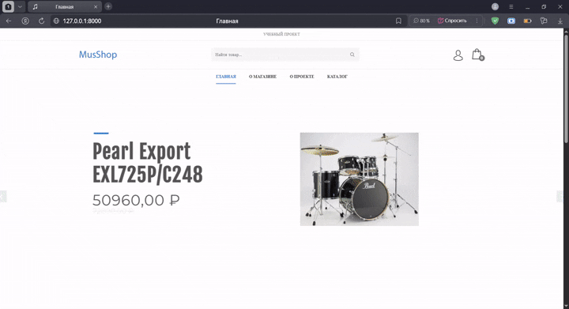
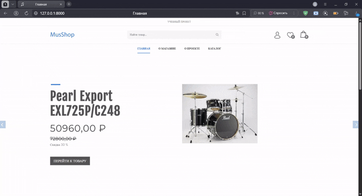
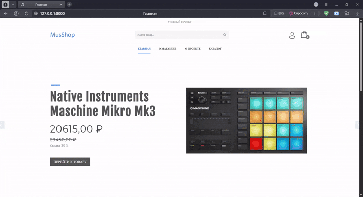
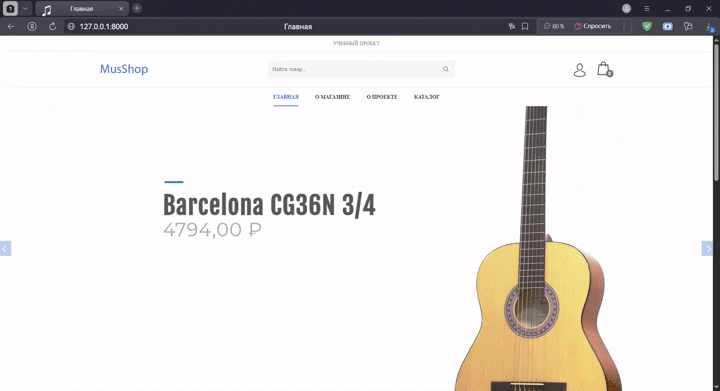
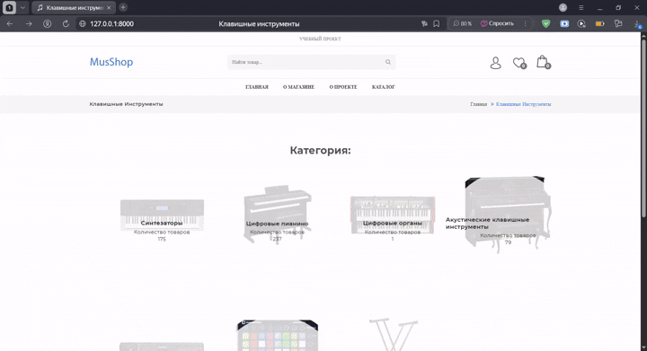
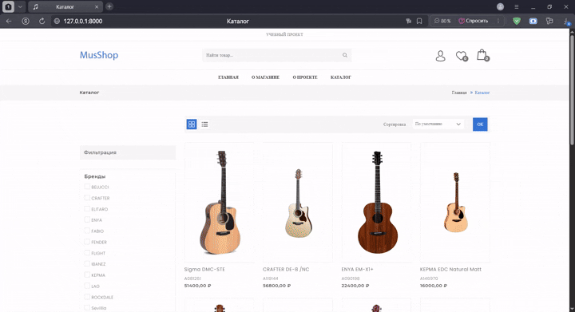
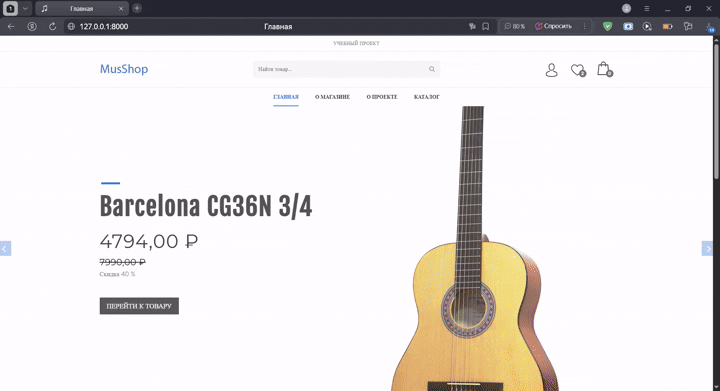

# Интернет-магазин музыкальных инструментов
---
## Оглавление
- [Описание](#описание)
- [Запуск](#запуск)
- [Демонстрация функционала](#демонстрация-функционала)
---
## Описание
Цель – разработать сайт, который будет содержать основной функционал интернет-магазина.

Тематика – музыкальные инструменты и аксессуары. Материалы для сайта были взяты с сайта Музторг - www.muztorg.ru. 

С указанного ресурса с помощью парсинга были собраны наименования категорий, подкатегорий, типов и брендов, а также основные сведения о товарах. Так как проект создан для практики, было принято решение собрать не все данные, а только часть их. Наличие и скидки были проставлены рандомно.

<h4 align="center">Функционал каталога:</h4>

- поиск товаров по артикулу или по словам из названия и описания;
- фильтрация по бренду и по наличию скидки;
- сортировка по цене (по возрастанию и убыванию);
- фильтрация по типу товара (для тех товаров, у которых они есть).

<h4 align="center">Функционал пользователя:</h4>

- регистрация;
- авторизация;
- редактирование данных своего аккаунта в профиле;
- добавление товаров в избранное;
- добавление товаров в корзину;
- редактирование корзины (изменение количества покупаемого товара и удаление позиций);
- оформление заказа;
- просмотр истории заказов;
- просмотр состава заказа;
- отмена заказа со статусом "в обработке".

<h4 align="center">Технологии:</h4>

- HTML, CSS, JS, jQuery;
- python, Django;
- PostgreSQL;
- git, docker.
  
---
## Запуск

<h4 align="center">Запуск локально (без Docker)</h4>

1)	Клонировать проект в пустую папку
`git clone https://github.com/examplesOfWorks/musshop.git`

2)	Создать виртуальное окружение и активировать его
```cmd
python -m venv venv
venv\Scripts\activate      # Windows
```
```bash
python -m venv venv
source venv/bin/activate   # Linux / macOS
```
3)	Перейти в папку с проектом (musshop) и установить зависимости
```bash
cd musshop
pip install -r requirements.txt
```
4)	Создать базу данных и её администратора в PostgreSQL используя pgAdmin 4.
5)	В папке с настойками проекта создать файл db_secret.py  и сохранить в переменные NAME, USER и PASSWORD название базы данных, имя пользователя и пароль от неё соответственно.
6)	Применить миграции и загрузить фикстуры в заданном порядке.
```bash
python manage.py migrate
python manage.py loaddata fixtures/goods/brands.json
python manage.py loaddata fixtures/goods/categories.json
python manage.py loaddata fixtures/goods/subcategories.json
python manage.py loaddata fixtures/goods/types.json
python manage.py loaddata fixtures/goods/products.json
python manage.py loaddata fixtures/goods/gallery.json
python manage.py loaddata fixtures/orders/delivery_method.json
```
7)	Создать администратора:
```bash
python manage.py createsuperuser
```
9)	Скачать архив с медиафайлами по ссылке https://drive.google.com/file/d/1RLh33K-FICeVh8u1Tpv-U5XB-AT5Vg6k/view?usp=drive_link. Распаковать архив, перенеся папку media в папку проекта.
10)	Запустить локальный сервер
```bash
python manage.py runserver
```
12)	Сайт будет доступен по адресу:
http://127.0.0.1:8000/ - сайт
http://127.0.0.1:8000/admin - панель администратора

<h4 align="center">Запуск с Docker</h4>

1)	Клонировать проект в пустую папку
```bash
git clone https://github.com/examplesOfWorks/musshop.git
```

3)	Перенести из папки musshop (папка с проектом) папку nginx, а также файлы .env и compose.yml в корневую папку. Структура должна быть следующей:
```
│   .env
│   compose.yml
├───musshop
└───nginx
```
3)	Скачать архив с медиафайлами по ссылке https://drive.google.com/file/d/1RLh33K-FICeVh8u1Tpv-U5XB-AT5Vg6k/view?usp=drive_link. Распаковать архив, перенеся папку media в папку проекта.
4)	Запустить проект:
```bash
docker-compose up --build -d
```
6)	Выполнить миграции:
```bash
docker compose exec musshop python manage.py migrate
```
8)	Загрузить фикстуры в заданном порядке:
```bash
docker compose exec musshop python manage.py loaddata fixtures/goods/brands.json
docker compose exec musshop python manage.py loaddata fixtures/goods/categories.json
docker compose exec musshop python manage.py loaddata fixtures/goods/subcategories.json
docker compose exec musshop python manage.py loaddata fixtures/goods/types.json
docker compose exec musshop python manage.py loaddata fixtures/goods/products.json
docker compose exec musshop python manage.py loaddata fixtures/goods/gallery.json
docker compose exec musshop python manage.py loaddata fixtures/orders/delivery_method.json
```
7)	Доступ:
http://127.0.0.1 – сайт
http://127.0.0.1:8080 – панель администратора. Данные для входа указаны в файле .env. База данных – PostgreSQL 
8)	Работа с контейнером:
```bash
docker compose stop # остановка контейнеров
docker compose start # запуск имеющихся контейнеров
```
или
```bash
docker compose down # остановка удаление контейнеров при сохранении образов и тома
docker compose up -d # создание контейнеров (при имеющихся образах и томе)
```
---
## Демонстрация функционала
| <p align="center">Главная страница</p> |  <p align="center">Поиск</p> |
|:-------------------------------------------------|---------------------------------------------------:|
|  |   |
---
| <p align="center">Регистрация</p> |  <p align="center">Авторизация</p> |
|:-------------------------------------------------|---------------------------------------------------:|
|   |    |
---
| <p align="center">Фильтрация и сортировка </p>  |  <p align="center">Добавление в избранное и фильтрация по типу </p>  |
|:-------------------------------------------------|---------------------------------------------------:|
|   |     |
---

| <p align="center">Добавление в корзину, оформление и удаление заказа </p>| <p align="center">Функционал профиля и его редактирование</p>   |
|:-------------------------------------------------|---------------------------------------------------:|
|    |


